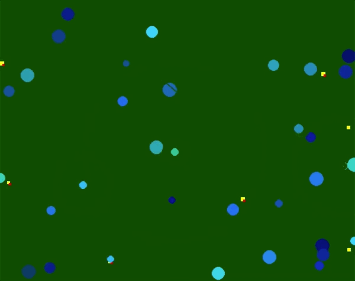

# Natural Selection Genetic Algorithm with Colorful Dots #

Designed a simulation for natural selection with a genetic algorithm, pygame, and perlin noise, and numpy. I found this simulation while browsing through middle school projects. 

 
  

## Each species has the following priority scores: ##

- Mating score (How likely a species is to reproduce and spawn new versions of themselves)
- Leisure score (How likely a species is to rest and increase their happiness property, which prolongs their lifespan)
- Food score (How likely they are to pursue yellow circles, food, which increases their hunger property and prevent early death)

## Each species also has the following physical attributes (genes that are passed down): ##

- Attractiveness (fitness score for how likely another species will find interest in the current species
- Natural Genetic Weight (property for how large the species will be, creating a tradeoff between movement speed and hunger sustainability levels)
- Genetic Happiness (property for how positive a species is, which can affect how long their lifespan is)
- Age (This figure grows naturally and increases the chance of death as age exceeds 100 years)
- Hunger (Current state of how hungry that species is. Lower hunger levels could help prioritize the species towards finding food)
- Coloring (physical genetic trait that can be passed down)

## Priority Logic: ##

- Each species can only prioritize either mating, leisure, or food at a time, depending on environmental factors (available levels of food, attractiveness of nearby species, etc.), genetic predispositions (priority scores), and current levels of hunger. 

## Movement Logic: ##

- Movement is made with 2D perlin noise, which can create "random" like movement.

## Dependencies: ##

- Python 3.9
- numpy
- pygame
- noise 
